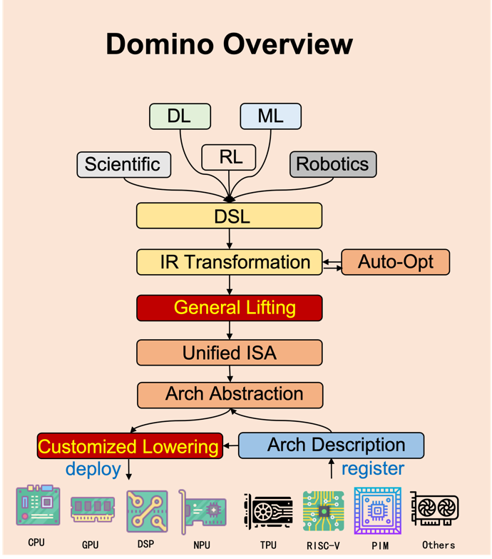

With the booming development of areas like scientific computing, AI, and robotics in recent years, the importance of tensor computations has become more and more prominent. In order to accelerate tensor computations, many acceleration mechanisms of traditional hardware have been highly emphasized (e.g. vector unit and multi-core), and many hardware or hardware units specifically designed for tensor computations are developed (e.g. NPU, PIM-hardware and GPU Tensor Core). However, in the face of numerous hardware devices and their acceleration mechanisms, developing the software stack on top of these hardware becomes a challenge. Manually writing optimized code for different tensor operators on different hardware is time-consuming, while automatically compiling and optimizing various operators on various hardware needs deep and comprehensive architectural analysis and insights, which is what current works are lack of. As a result, it is very difficult to design high performance and portable implementation on different hardware architectures. 

To solve this problem, we propose to create an open-source tensor compiler framework named Domino, which allows hardware developers to add just a small amount of code to let users from areas like machine learning and scientific computing easily enjoy nearly the full acceleration capabilities the hardware can bring.  The main goal of Domino project is to find the similarity among different architectures and develop the right level of abstraction of them to minimize the work needed for developing a software stack on a new hardware architecture. Our recent work on designing abstraction for spatial hardware and systolic array shows that our goal is achievable and can lead to significant impact on the software stack development of hardware architectures for tensor computations, and we base our Domino project on these work. Below we summarize the key idea and overall workflow of Domino.

## Key Idea: Virtual Instruction Set Architecture

Virtualization is a prevalent technique used in compiler domain. It can provide a unified interface and make the high-level implementations portable for different low-level components. For example, JVM (Java Virtual Machine) makes the java code portable for different CPU architectures, and TVM (Tensor Virtual Machine) makes the deep learning model portable for different traditional architectures like CPU and GPU. Therefore, to unify the different instructions for tensor computing provided by different underlying hardware architectures, we design a Virtual-Instruction-Set-Architecture (VISA). VISA includes the basic operations of data movement, scalar computing, vector computing, matrix computing etc. With VISA, we can develop only one software stack, which optimizes and compiles tensor computations into VISA. If a new  hardware architecture is invented, what the hardware developer need to do is just provide the description of how to map VISA into the hardware's ISA.

## Workflow of Domino Compiler

1. We provide a front-end DSL embedded in popular high-level languages like Python for user to represent the tensor computations to be compiled. 
2. The front-end DSL will be directly translated into initial IR (intermediate representation) via parsing. 
3. The initial IR will be optimized with some traditional compiler optimizations like constant folding, some loop optimizations like loop-tiling and some tensor-related optimizations like vectorization. Some optimization contains tunable parameters, and we provide an auto-tuning infrastructure to iteratively optimize them. 
4. We will recognize some computation patterns (e.g., data-movement, vector-add, matrix multiplication, convolution) and lift the optimized IR into VISA. Note that an optimized IR may be lifted into multiple different codes of VISA, and we provide an auto-tuning infrastructure to find the best one. 
5. VISA will be translated into target hardware language based on the pre-registered architecture description provided by hardware developer. 
6. Finally, the hardware language will be executed on target hardware. The performance information may be feedbacked to Domino to guide the IR optimization tuning.

Publications
1.  [**AMOS: Enabling Automatic Mapping for Tensor Computations on   Spatial Accelerators with Hardware Abstraction. (ISCA’22)**](https://dl.acm.org/doi/10.1145/3470496.3527440)
2.  [NeoFlow: A Flexible Framework for Enabling Efficient Compilation for High Performance DNN Training (TPDS’22)](https://ieeexplore.ieee.org/document/9664259/)
3.  [HASCO: Towards Agile Hardware and Software Co-design for Tensor Computation. (ISCA’21)](https://arxiv.org/abs/2105.01585)
4.  [FlexTensor: An Automatic Schedule Exploration and Optimization Framework for Tensor Computation on Heterogeneous System. (ASPLOS’20)](https://dl.acm.org/doi/10.1145/3373376.3378508)

Open-source Projects:
1.  [AMOS](https://github.com/pku-liang/AMOS)
2.  [HASCO](https://github.com/pku-liang/HASCO)
3.  [FexTensor](https://github.com/pku-liang/FlexTensor)
